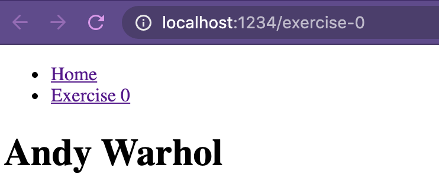
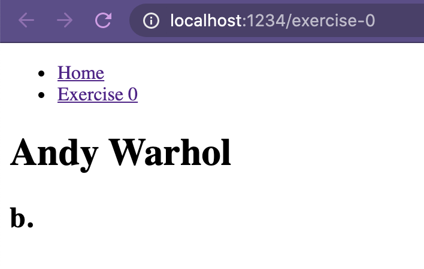
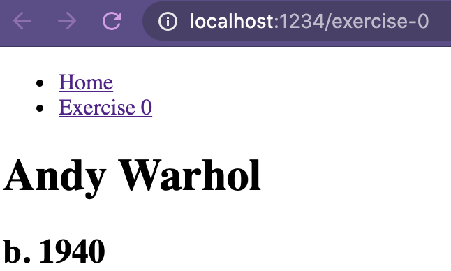
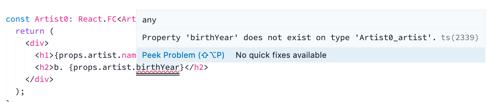

# Relay Compiler

## Introduction - What is the Relay compiler?

> Relay is a JavaScript framework for building data-driven React applications powered by GraphQL, designed from the ground up to be easy to use, extensible and, most of all, performant. Relay accomplishes this with static queries and ahead-of-time code generation.

_Source: [Introduction to Relay](https://relay.dev/docs/en/introduction-to-relay)_

All modern JavaScript web apps face the challenge of managing data effectively and performantly. Relay is a library that addresses this problem for React apps. 

Relay allows us to specify the data needed for each component _within each component_. This makes for a nice developer experience because the data is defined right next to the code rendering it. 

Independently querying for the data that each component needs would be terribly inefficient. To address this, Relay aggregates the data needed for all components in a tree into one top-level query — so one network request is made for _all_ the required data on the page. 

At build-time, Relay's compiler inspects the component tree to discover all data needed, and generates the appropriate infrastructure to execute optimized GraphQL queries at runtime.

In this exercise we'll see how the Relay compiler generates the artifacts it needs to make efficient data requests.

## Exercise 0: Compiling with Relay

### Setting up

Start the app:

💻 _Run `yarn start-exercise-1` from a console pointed at the root of this project_

View the app for this exercise in a browser:

💻 _Visit [localhost:1234/exercise-0](http://localhost:1234/exercise-0)_

### Orient yourself

This app renders information about an artist. 



The component rendering the artist information is [the Artist0 component](./Artist0.tsx). It emits the artist name (TODO: line number): 

```tsx
  return (
    <div>
      <h1>{props.artist.name}</h1>
    </div>
  );
```

The component is connected to Relay (don't worry about _how_ yet). It queries for data on the `Artist` type of our GraphQL schema by defining a query fragment (TODO: line number): 

```graphql
  fragment Artist0_artist on Artist {
    name
  }
```

The Relay compiler inspects fragments like this one to generate the infrastructure it needs to efficiently query our GraphQL endpoint at runtime. 


### Enhance the Artist0 component

It'd be nice if our users could see the artist's year of birth in addition to their name. Lucky for us: our GraphQL schema exposes that data for us! In addition to `id` and `name`, the `Artist` type defined in our schema also holds a `birthYear` property (TODO: link to schema):

```graphql
  type Artist {
    id: ID!
    name: String!
    birthYear: Int!
  }
```

We want to update our component to query and emit this field.

### Add the field to the component

Start by adding the `birthYear` property to the GraphQL query fragment.

💻 _Add `birthYear` to [line TODO in the Artist0 component](./Artist0.tsx):_

```graphql
  fragment Artist0_artist on Artist {
    name
    birthYear
  }
```

Then we'll need to render the field in the React component.

💻 _Add a line to render the `birthYear` field in [the Artist0 component](./Artist0.tsx):_

```typescript
  return (
    <div>
      <h1>{props.artist.name}</h1>
      <h2>b. {props.artist.birthYear}</h2>
    </div>
  );
```

💻 _Save the Artist0.tsx file._

Your browser should auto-refresh. You should see.....

A place for the birth year to display, but no actual birth year. 



### 🤔 Why doesn't this work? 

We added the field to the component, and the GraphQL query...but Relay hasn't compiled this new field into its runtime infrastructure. Relay needs to aggregate all the requested data at build-time, so that it knows the proper query to send to the server. Our app is not requesting this new field from GraphQL yet because the Relay compiler hasn't included it yet. 

Let's fix this!

### Run the Relay compiler

💻 _Run `yarn relay` from a terminal._

This shouldn't take long to run, and the output shouldn't contain any errors. When it's finished your page should reload with the artist's birth year now showing!



🎉 We did it!

### What did the Relay compiler do?

You might have noticed a `__generated__` subfolder in `./src/exercises/0-Relay-Compiler`. This folder contains all the infrastructure generated by the Relay compiler — everything it needs to query our GraphQL endpoint at runtime. 

There's a file in here named [`Artist0_artist.graphql.ts`](__generated__/Artist0_artist.graphql.ts). If we look inside, we'll find a couple changes that Relay made when we ran the compiler:

#### Relay added the new field to the query that will be used at runtime.

Toward the bottom of [`Artist0_artist.graphql.ts`](__generated__/Artist0_artist.graphql.ts) (TODO: line numbers) you'll see a variable named `node` defined. This defines the shape of the query that Relay will be making for this component at runtime, and it now contains the field we added: 

```typescript
const node: ReaderFragment = {
  // ....
  "name": "Artist0_artist",
  // ....
  "selections": [
    // ....
    {
      "alias": null,
      "args": null,
      "kind": "ScalarField",
      "name": "birthYear",
      "storageKey": null
    }
  ],
  "type": "Artist",
    // ....
};
```

#### Relay added the new field to the associated types.

We're using TypeScript in this tutorial, and we've configured our compiler to generate TypeScript types for our Relay components via the `relay-compiler-language-typescript` language plugin. TypeScript **is not required** to work with Relay, but it is extremely helpful. It greatly reduces the chances that you'll reference a property that doesn't exist or that you haven't queried for, because TypeScript will show you an error in those situations.

You might have noticed that before we ran the compiler, we had red squigglies complaining about types missing in our `Artist0.tsx`:



This was a clue to us that Relay hadn't run. The type for this query fragment didn't yet include the property we added.

Once we ran the compiler, the error went away because the property had been added to the type associated with this component (TODO: line number):

```typescript
export type Artist0_artist = {
    readonly name: string;
    readonly birthYear: number;
    readonly " $refType": "Artist0_artist";
};
```

## Wrapping up

In this exercise, we added a new property to an existing Relay-connected component. We saw how the component didn't render our new field until after we ran the Relay compiler. We also looked at the artifacts generated by the Relay compiler.

In day-to-day development with Relay, adding or removing fields from Relay-connected components is a frequent activity. Inspecting the artifacts generated by the Relay compiler is a much less frequent activity — most useful for debugging and other scenarios where things aren't working as expected. 

## Resources

The [Thinking In Relay](https://relay.dev/docs/en/thinking-in-relay) doc is a great resource for understanding how Relay efficiently renders data from a GraphQL endpoint.
