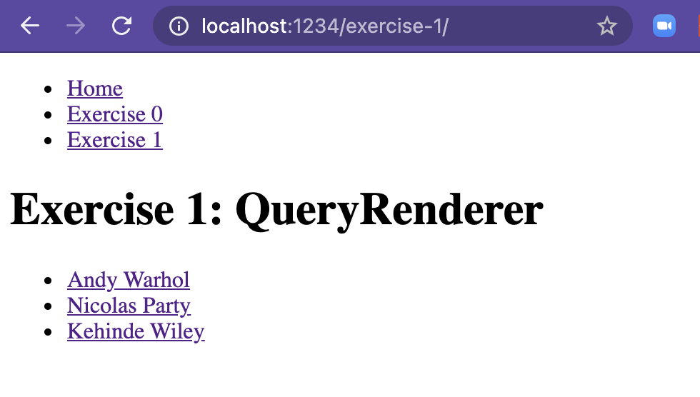
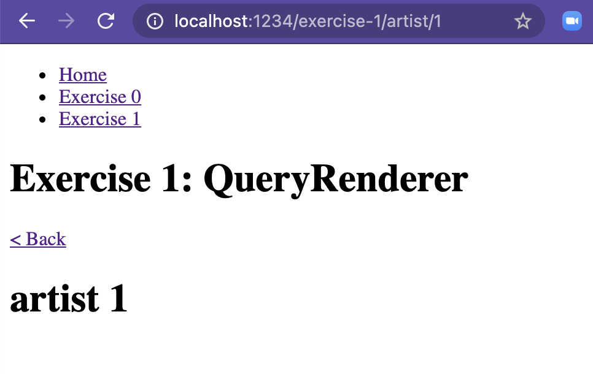
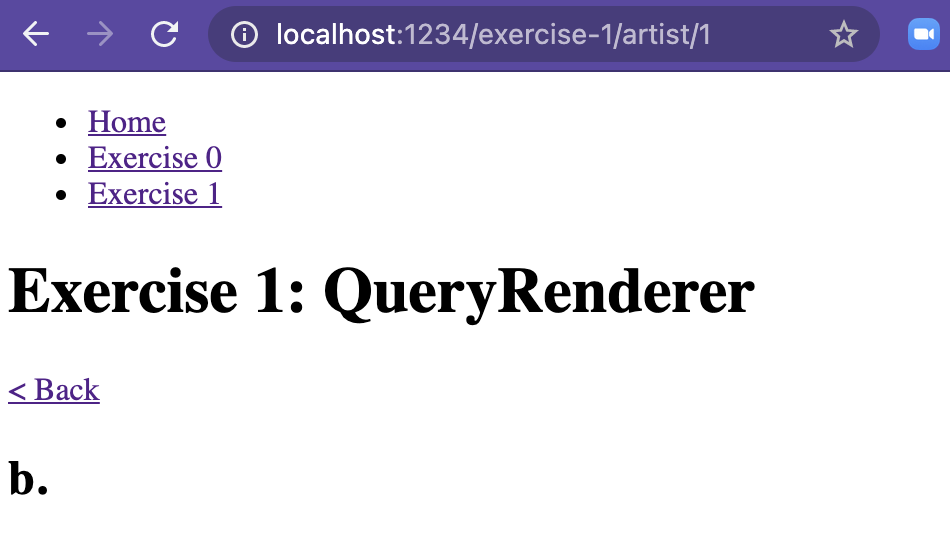
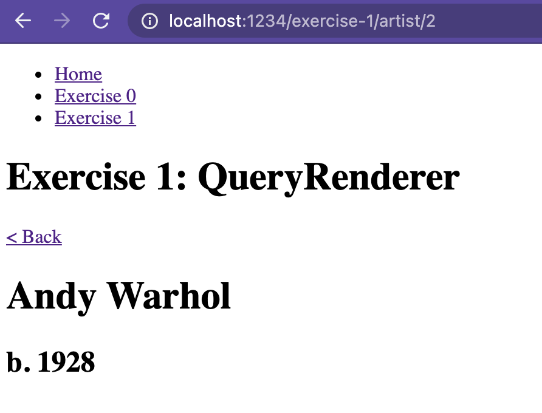
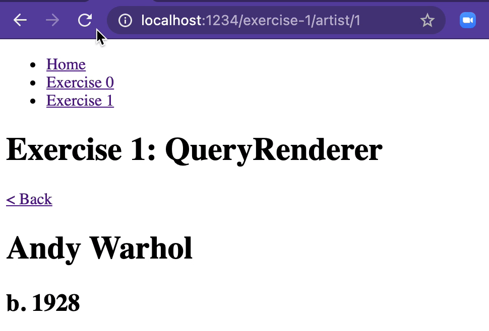
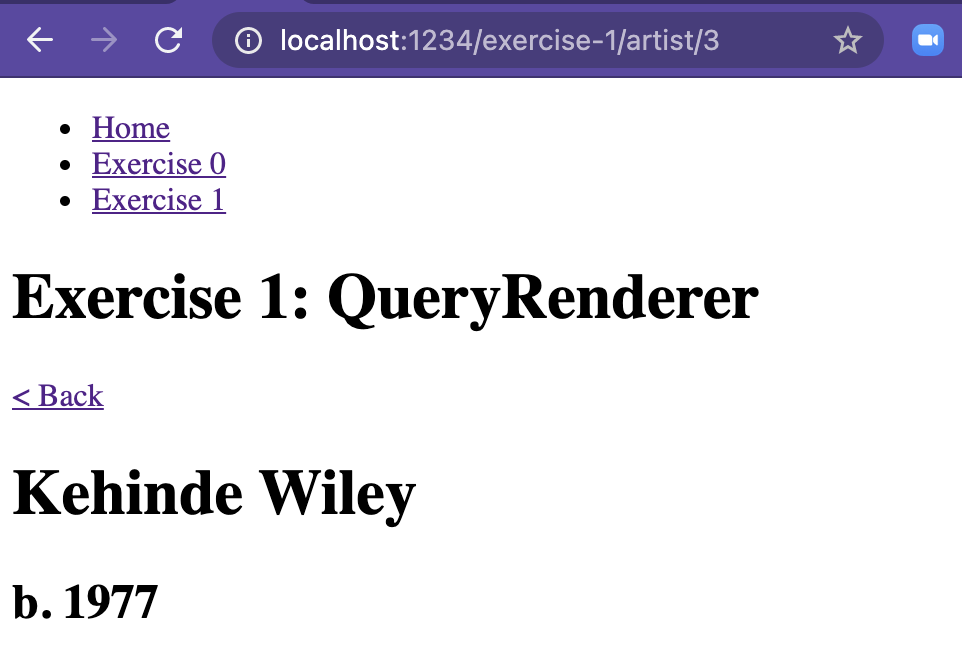

# QueryRenderer

## Introduction - What is a QueryRenderer?

> A QueryRenderer is a React Component at the root of a Relay component tree. It takes a query, fetches the given query, and uses the render prop to render the resulting data.

_Source: [Relay docs: QueryRenderer](https://relay.dev/docs/v10.1.3/query-renderer)_

We've mentioned that Relay aggregates all the data needed for a component tree to render data from a GraphQL source. The component responsible for making the actual request for data is the QueryRenderer.

Therefore we must emit a QueryRenderer for any tree of components that we want to hydrate with data.

A QueryRenderer takes two critical arguments: a query to execute against the GraphQL endpoint, and the React component to render once the data is retrieved.

🎯 In this exercise we'll create a new page in our app and use a QueryRenderer to show data from our GraphQL endpoint.

## Exercise 1: Rendering data with a QueryRenderer

### Setting up

Start the app:

💻 _Run `yarn start-exercises` from a console pointed at the root of this project_

Note: if you get an error when running this command that you need `watchman` installed, install it with `brew install watchman` and retry.

View the app for this exercise in a browser:

💻 _Visit [localhost:1234/exercise-1](http://localhost:1234/exercise-1)_

### Orient yourself

This app renders a list of artists.



When you click on an artist's name, it takes you to a new URL with the artist ID in the path. The page emits the artist's ID.



There are two components responsible for rendering the artist detail page:

1: [The Artist1 component](./Artist1.tsx) renders the UI. It's currently emitting a heading with the artist's ID, based on the `artist` prop passed into the component:

```typescript
export const Artist1: React.FC<Artist1Props> = props => {
  return (
    <div>
      <h1> artist {props.artist.artistID} </h1>
    </div>
  )
}
```

_./Artist1.tsx_

2: [The Artist1QueryRenderer component](./Artist1QueryRenderer.tsx) is the entry point to this page. It extracts the artist ID from the current path, and renders the Artist1 UI component based on the dummy artist object:

```typescript
export const Artist1QueryRenderer = () => {
  const { artistID } = useParams()
  const dummyArtist = {
    artistID,
  }

  return <Artist1 artist={dummyArtist} />
}
```

_./Artist1QueryRenderer.tsx_

Note that `useParams` is a hook from `react-router-dom` that extracts the artistID from the path.

### Render some artist data

An artist ID doesn't mean much to a user. Let's update this page to show actual data about the current artist!

#### Update the UI component to render artist data

💻 _Update [the Artist1](./Artist1.tsx) component to render the artist name and birth year from props:_

```typescript
return (
  <div>
    <h1>{props.artist.name}</h1>
    <h2>b. {props.artist.birthYear}</h2>
  </div>
)
```

_./Artist1.tsx_

Save the file, and you should see that we're not displaying anything useful on the artist detail screen:



This is because our screen isn't loading any artist data.

#### Add a QueryRenderer to retrieve artist data

We're going to modify our Artist1QueryRenderer to use a Relay `<QueryRenderer>` component to connect our page to our GraphQL endpoint.

💻 _Add import statements for some dependencies to Artist1QueryRenderer:_

```typescript
import { graphql, QueryRenderer } from "react-relay"
import { environment } from "../../relay"
```

_./Artist1QueryRenderer.tsx_

`QueryRenderer` is the component we'll use to connect our component to the GraphQL endpoint; `graphql` helps us specify the GraphQL query that should be made.

We'll talk about the `environment` dependency in an upcoming exercise. For now you don't need to know much about it other than it's a place for Relay to cache network requests.

💻 _Update the Artist1QueryRenderer component to return a QueryRenderer:_

```typescript
return (
  <QueryRenderer
    environment={environment}
    query={graphql`
      query Artist1QueryRendererQuery {
        artist(id: 1) {
          name
          birthYear
        }
      }
    `}
    variables={{}}
    render={() => <Artist1 artist={dummyArtist} />}
  />
)
```

_./Artist1QueryRenderer.tsx_

This doesn't give us exactly what we want, but it's the simplest QueryRenderer we can emit. When you save, you shouldn't see any changes on the artist page.

Let's work through the props we're passing into this `QueryRenderer`.

##### `environment={environment}`

As mentioned above, this will get covered in more detail later, but the `environment` is a place for Relay to cache network requests among other things.

##### `` query=graphql`...` ``

The `query` argument is the query we want to execute against our GraphQL endpoint.

For now, our query is requesting the `name` and `birthYear` of the `artist` with `id:1`. We'll correct that hard-coded artist ID soon!

Relay is very particular about the names you give queries. 

💻 _Try changing the name of the query from `Artist1QueryRendererQuery` to `Artist1QueryRendererQueryyyyyy` and see what happens in your console:_

```
[relay] Parse error: Error: RelayFindGraphQLTags: Operation names in graphql tags must be prefixed with the module name and end in "Mutation", "Query", or "Subscription". Got `Artist1QueryRendererQueryyyyyy` in module `Artist1QueryRenderer`. in "exercises/01-Query-Renderer/Artist1QueryRenderer.tsx"
```

This is an easy mistake to make — expect to encounter this error many times with Relay 😅.

💻 _Change `Artist1QueryRendererQueryyyyyy` back to `Artist1QueryRendererQuery`._

##### `variables={{}}`

The `variables` prop takes an object containing variables to pass into the query. For now we're passing an empty object.

##### `render={() => <Artist1 artist={artist}>}`

The `render` prop is a function that will be called to render the child component tree. The argument to that function is an object that includes props, among other things. `props` is destructured from the `render` prop function's argument.

For now we're telling it to render an `Artist1` component using the `artist` object we constructed from the URL params. We're not passing the artist from the server response yet. This explains why we still don't see anything useful on our artist detail page.

💻 _Update the `render` prop to pass the artist from the resolved query as a prop if it exists instead of from the dummy object:_

```typescript
  render={({ props }) => {
    if (!props || !props.artist) {
      return null;
    }
    return <Artist1 artist={props.artist} />;
  }}
```

_./Artist1.tsx_

After saving, you should finally see artist info on the artist page! If you see a type error, read on! We are about to address it.



##### Fix types for artist

If you notice we are seeing some type errors in the `render` prop of the QueryRenderer that read `Property 'artist' does not exist on type 'unknown'.`. The QueryRenderer component takes a type argument that corresponds to the type of `props`. Relay compiler generated this type for us based on the query we passed, but we haven't attached it to the QueryRenderer yet. We need to import this generated type and then pass it to the QueryRenderer.

💻 _Import the Artist1QueryRendererQuery type and pass it to the QueryRenderer as a type argument:_

```typescript
import { Artist1QueryRendererQuery } from "./__generated__/Artist1QueryRendererQuery.graphql"

// ...

  return (
    <QueryRenderer<Artist1QueryRendererQuery>
      environment={environment}
      query={graphql`
        query Artist1QueryRendererQuery {
          artist(id: 1) {
            name
            birthYear
          }
        }
      `}
      ...
    />
  );
```

_./Artist1QueryRenderer.tsx_

Now we should no longer have any type errors. Red squigglies are gone! 🎉

##### Add a loading indicator

When we render this component for the first time we won't have an artist because Relay hasn't resolved the network requests yet. We check for the presence of the artist and if it isn't present yet we return null. Here we replace that with a loading indicator to let the user know the network is processing.

💻 _Update our if block when there is no artist to return a loading div:_

```typescript
  render={({ props }) => {
    if (!props || !props.artist) {
      return <div>Loading</div>;
    }
    return <Artist1 artist={props.artist} />;
  }}
```

_./Artist1QueryRenderer.tsx_

If you refresh the page you'll notice that while the network is resolving we display a loading indicator.



#### Pass arguments to the query

Our GraphQL query has the artist ID hardcoded:

```graphql
  artist(id: 1) {
    name
    birthYear
  }
```

_./Artist1QueryRenderer.tsx_

This results in the same artist always showing, no matter which artist page we're on. Let's fix this.

##### Step 1: Move the hardcoded artistID from the query prop to the variables prop

Arguments can be passed into the `query` of a `QueryRenderer` through the `variables` prop. Let's move the hardcoded artist ID to a variable.

💻 _Add a variable to the `query` prop named `artistID`:_

```typescript
<QueryRenderer<Artist1QueryRendererQuery>
  // ...
  query={graphql`
        query Artist1QueryRendererQuery($artistID: ID!) {
          artist(id: $artistID) {
            // ...
          }
        }
      `}
  // ...
/>
```

_./Artist1QueryRenderer.tsx_

Notice that we add the variable to the top-level `query` as well as the `artist` type we're querying.

At this point you'll get a type error on the `variables` prop. This is because the query is expecting a property named `artistID` on the `variables` argument.

💻 _Add a hardcoded `artistID` to the `variables` prop:_

```typescript
<QueryRenderer<Artist1QueryRendererQuery>
  // ...
  variables={{ artistID: "1" }}
  // ...
/>
```

_./Artist1QueryRenderer.tsx_

Save and refresh and you'll see...not much is different. We merely moved the hardcoded value from one place to another.

But! Now that we're passing the `artistID` _into_ the `QueryRenderer`, we can pass whatever we want — like the ID from the current route!

##### Step 2: Grab value of variable from route

We're already grabbing the artistID from the route params. We need to pass it into our query.

💻 _Replace the hardcoded `artistID` variable with the value from the route parameter:_

```typescript
<QueryRenderer<Artist1QueryRendererQuery>
  // ...
  // pass the artistID variable we extracted from the route:
  variables={{ artistID }}
  // ...
/>
```

_./Artist1QueryRenderer.tsx_

The last step for relay to understand which variable you are passing is to pass the variable next to Artist1QueryRendererQuery like this:

```typescript
     query Artist1QueryRendererQuery(**$artistID: ID!**){ 
        artist(**id: $artistID**){
           name
           birthYear
         }
     }
```

This is how the whole component should look like in the end:

``` typescript
import React from 'react';
import { useParams } from 'react-router-dom';
import { Artist1 } from './Artist1';

export const Artist1QueryRenderer = () => {
  const { artistID } = useParams();

  return (
    <QueryRenderer<Artist1QueryRendererQuery>
      environment={environment}
      query={graphql`
        query Artist1QueryRendererQuery($artistID: ID!) {
          artist(id: $artistID) {
            name
            birthYear
          }
        }
      `}
      variables={{ artistID }}
      render={({ props }) => {
        if (!props || !props.artist) {
          return <div>Loading</div>;
        }
        return <Artist1 artist={props.artist} />;
      }}
    />
  );
};

```


Now when we visit [Kehinde Wiley's page](http://localhost:1234/exercise-1/artist/3) we see his info! 🕺💃



## Wrapping up

In this exercise we connected our React component to our GraphQL endpoint with a Relay `QueryRenderer`. (Technically a `react-relay` `QueryRenderer` — [all the React components associated with Relay exist in that package](https://relay.dev/docs/v10.1.3/architecture-overview#core-modules).)

When our component first renders, our `QueryRenderer`'s `render` prop gets called, with empty `props`. This paints a `Loading` indicator to the screen.

Meanwhile, Relay makes a network request to our GraphQL endpoint. It passes the `query` and `variables` props from our `QueryRenderer` to the GraphQL server.

When the server responds, the `QueryRenderer` calls the `render` prop again, this time with `props` loaded from the network response. This renders our component tree, hydrated with data.

In day-to-day development with Relay, you'll work with QueryRenderers occasionally — typically when you're adding a new page or screen, or when you need a test or storybook to connect a component to GraphQL data.

## Recommendations

### Be careful nesting QueryRenderers

Each QueryRenderer is associated with one request to our GraphQL server. As we continue to build out our Artist page, we'll want to add child components for things like their artworks, their bio, etc. What we've learned so far might give us the impression that each of those child components would be associated with its own QueryRenderer. This would cause a problem — the child components' QueryRenderers would make separate network requests, causing performance issues.
The correct approach to this situation is to associate the child components with something called a Fragment Container — which we'll learn about [in the next exercise](../02-Fragment-Container/README.md).

> As React components, QueryRenderers can be rendered anywhere that a React component can be rendered, i.e. not just at the top level but within other components or containers; for example, to lazily fetch additional data for a popover.
>
> However, a QueryRenderer will not start loading its data until it is mounted, so nested QueryRenderer components can lead to request waterfalls if used unnecessarily.

_Source: [Relay docs: QueryRenderer](https://relay.dev/docs/v10.1.3/query-renderer)_

## Resources

- [Relay docs: QueryRenderer](https://relay.dev/docs/v10.1.3/query-renderer)
- [Relay docs: Architecture Overview](https://relay.dev/docs/v10.1.3/architecture-overview#core-modules)
