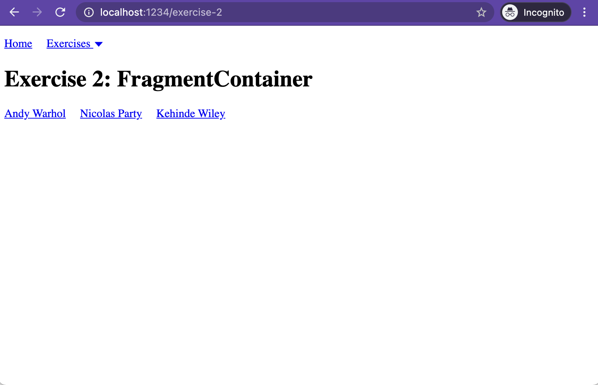
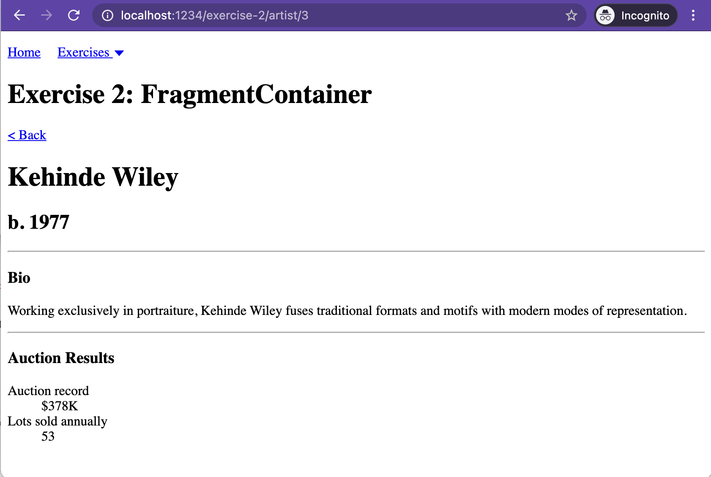

# Fragment Container

## Introduction - What is a Fragment Container?

> A Fragment Container is a higher-order component that allows components to specify their data requirements. A container does not directly fetch data, but instead declares a _specification_ of the data needed for rendering, and then Relay will guarantee that this data is available _before_ rendering occurs.

_Source: [Relay docs: Fragment Container](https://relay.dev/docs/v10.1.3/fragment-container/)_

Building a React app requires intentional effort to isolate components. Markup, styles, state management, etc. typically belong to the nearest component that needs them.

Relay allows us to also precisely define the _data_ required to render each component in a tree, with Fragment Containers.

If a QueryRenderer is the top-level component of a tree that renders data, Fragment Containers define the contract each child component needs from the data. While there is a single QueryRenderer associated with each network request in our app, each request will retrieve the data for many Fragment Containers. Imagine the QueryRenderer as the tree and the Fragment Container as its branches.

In this exercise we'll convert several small, isolated components into Fragment Containers, and specify the data each component requires.

## Exercise 2: Isolating specified data with a Fragment Container

### Setting up

Start the app:

💻 _Run `yarn start-exercises` from a console pointed at the root of this project_

View the app for this exercise in a browser:

💻 _Visit [localhost:1234/exercise-2](http://localhost:1234/exercise-2)_

### Orient yourself

This app looks pretty similar to the app in Exercise 1. It renders a list of artists:



When you click on an artist's name, it takes you to a detail page for that artist. The artist detail page shows the artist name and birth year, bio, and some auction result data:



We're going to focus on the artist detail page for this exercise.

#### Artist2QueryRenderer component

The top-level component responsible for rendering the artist detail page is the [`Artist2QueryRenderer`](./Artist2QueryRenderer.tsx) component. It should look pretty familiar if you worked through [the previous exercise](../01-Query-Renderer/README.md).

When the `Artist2QueryRenderer` gets back data from the GraphQL server, it renders an `Artist2` component:

```typescript
export const Artist2QueryRenderer = () => {
  ...

  return (
    <QueryRenderer<Artist2QueryRendererQuery>
      ...
      render={({ props }) => {
        ...
        return <Artist2 artist={props.artist} />;
      }}
    />
  );
```

#### Artist2 component

The [`Artist2`](./Artist2.tsx) component lays out the different sections of our artist detail page: a [heading](./Artist2Heading.tsx) section, a [bio](./Artist2Bio.tsx) section, and a section for [auction results](./Artist2AuctionResults.tsx).

It passes an artist prop through to each of the child components.

```typescript
export const Artist2: React.FC<Artist2Props> = ({ artist }) => {
  return (
    <div>
      <Artist2Heading artist={artist} />
      <hr />
      <Artist2Bio artist={artist} />
      <hr />
      <Artist2AuctionResults artist={artist} />
    </div>
  )
}
```

#### Artist2Heading, Artist2Bio, and Artist2AuctionResults components

Each of these section components emits some data from the `artist` prop passed in.

This style of component isolation is a common and powerful way to build a React app. Each component includes all the markup, styles, and interaction logic it needs. This is great for reusability, and even greater for comprehensibility.

One thing is missing from each of these components though — a specification of the data it needs to render properly. That's currently handled entirely in the [`Artist2QueryRenderer`](./Artist2QueryRenderer.tsx), where _all_ fields for _all_ components are aggregated:

```
      query={graphql`
        query Artist2QueryRendererQuery($artistID: ID!) {
          artist(id: $artistID) {
            name
            birthYear
            bio
            auctionRecord
            auctionLotsSoldAnnually
          }
        }
      `}
```

This works, but it's an anti-pattern because it binds the child components data needs to its parent or grandparents. This not only gets in the way of making our components reusable, but also can make refactoring or scaling components tricky when we have to go a few levels up to find where data is coming from. It'd be great if we could specify these fields in the components that needed them. Then each component would tell a more comprehensive story about what's needed to render it.

Relay offers us Fragment Containers for exactly this purpose. Let's convert these child components to be Fragment Containers!

### Convert `Artist2` to a Fragment Container

We'll start by converting the component that combines all our sections together, the `Artist2` component.

💻 _Add an import statement to `Artist2` for the `react-relay` dependencies we'll need:_

```typescript
import { createFragmentContainer, graphql } from "react-relay"
```

_./Artist2.tsx_

`createFragmentContainer` is a [higher-order component (HOC)](https://reactjs.org/docs/higher-order-components.html), or function that generates a new component based on another component. We'll use it to create a Fragment Container from our `Artist2` display component.

`graphql` helps us specify the GraphQL fragment associated with this component.

💻 _Define and export a new Fragment Container:_

```typescript
export const Artist2FragmentContainer = createFragmentContainer(Artist2, {
  artist: graphql`
    fragment Artist2_artist on Artist {
      name
      birthYear
      bio
      auctionRecord
      auctionLotsSoldAnnually
    }
  `,
})
```

_./Artist2.tsx_

The first argument to `createFragmentContainer` is the display component you want to turn into a Fragment Container.

The second argument is an object containing properties for each root-level field your component needs to query. In this case, our GraphQL specifies `fragment Artist2_artist on Artist`, which indicates we need these fields from the `Artist` type of our GraphQL endpoint. The results of this query fragment will be passed to our `Artist2` component as a prop named `artist`.

We learned in the previous exercise that Relay is particular about the names you give queries associated with QueryRenderers — it's also very particular about the names of fragments you specify for Fragment Containers. Try changing the name of the GraphQL fragment from `Artist2_artist` to `Artist2_artisttttt` and you'll get an error in your console:

```
[relay] Parse error: Error: RelayFindGraphQLTags: Container fragment names must be `<ModuleName>_<propName>`. Got `Artist2_artist`, expected `Artist2_artist`. in "exercises/02-Fragment-Container/Artist2.tsx"
```

This is another easy mistake to make.

💻 _Replace the `Artist2Props` interface with one generated by Relay:_

```typescript
import { Artist2_artist } from "./__generated__/Artist2_artist.graphql"

// ...

interface Artist2Props {
  artist: Artist2_artist
}
```

_./Artist2.tsx_

When Relay compiled our Fragment Container, it generated this type for us. It might not look like much in this example, but this type-generation saves us from countless typos.

💻 _Replace the `Artist2` component with the new `Artist2FragmentContainer` in `Artist2QueryRenderer`:_

```typescript
import { Artist2FragmentContainer } from './Artist2';

// ...

  render={({ props }) => {
    if (!props || !props.artist) {
      return <div>Loading</div>;
    }
    return <Artist2FragmentContainer artist={props.artist} />;
  }}

// ...
```

_./Artist2QueryRenderer.tsx_

At this point, there are no visible changes in the browser...but there's now an `Artist2FragmentContainer` being rendered by our `Artist2QueryRenderer`!

Our final step for this conversion is to remove the individual fields specified in our `Artist2QueryRendererQuery` query.

💻 _Replace the individual fields specified in the `Artist2QueryRendererQuery` query with the `Artist2_artist` query fragment:_

```typescript
  query={graphql`
    query Artist2QueryRendererQuery($artistID: ID!) {
      artist(id: $artistID) {
        ...Artist2_artist
      }
    }
  `}
```

_./Artist2QueryRenderer.tsx_

A few things to point out:

1. The `...` before `Artist2_artist` is how we include a fragment in a GraphQL query. Conceptually it's similar to the [spread operator](https://developer.mozilla.org/en-US/docs/Web/JavaScript/Reference/Operators/Spread_syntax) in JavaScript — as if to say, "replace everything here with whatever is defined in the fragment."

2. The fragment name (`Artist2_artist`) must match exactly the name defined in our `Artist2FragmentContainer`.

3. We don't need to import `Artist2_artist` at the top of Artist2QueryRenderer because it's not a JavaScript reference. We're referencing `Artist2_artist` inside a string — delimited by the back-ticks (`) surrounding our GraphQL query. While this name/token is parsed by Relay to assemble queries for the server, it isn't parsed by JavaScript because it's nothing more than text.

Time to celebrate, because `Artist2QueryRenderer` no longer has any knowledge of fields it doesn't use! Yay, component isolation 🙌

#### Convert the section components (`Artist2Heading`, `Artist2Bio`, and `Artist2AuctionResults`) to Fragment Containers

While we removed the data contract from the `Artist2QueryRenderer`, `Artist2` is still defining a data contract that is too granular for what it's displaying. It's not emitting _any_ fields from the `Artist` GraphQL type; why should it be specifying everything its children need?

To resolve this, we're going to repeat the process of converting to Fragment Containers for each of our individual section components. We'll tackle one of these together — the `Artist2Heading` — and you'll convert the final two on your own. Each conversion will look very similar to the `Artist2` conversion we just completed.

##### Convert the `Artist2Heading` component

💻 _Add an import statement to `Artist2Heading` for the `react-relay` dependencies we'll need:_

```typescript
import { createFragmentContainer, graphql } from "react-relay"
```

_./Artist2Heading.tsx_

💻 _Define and export a new Fragment Container:_

```typescript
export const Artist2HeadingFragmentContainer = createFragmentContainer(
  Artist2Heading,
  {
    artist: graphql`
      fragment Artist2Heading_artist on Artist {
        name
        birthYear
      }
    `,
  }
)
```

_./Artist2Heading.tsx_

💻 _Replace the `Artist2HeadingProps` interface with one generated by Relay:_

```typescript
import { Artist2Heading_artist } from "./__generated__/Artist2Heading_artist.graphql"

// ...

interface Artist2HeadingProps {
  artist: Artist2Heading_artist
}
```

_./Artist2Heading.tsx_

💻 _Replace the `Artist2Heading` component with the new `Artist2HeadingFragmentContainer` in `Artist2`:_

```typescript
import { Artist2HeadingFragmentContainer } from './Artist2Heading';

// ...

export const Artist2: React.FC<Artist2Props> = ({ artist }) => {
  return (
    <div>
      <Artist2HeadingFragmentContainer artist={artist} />
      <hr />
// ...

```

_./Artist2.tsx_

💻 _Replace the individual fields specified in the `Artist2_artist` query fragment with the `Artist2Heading_artist` query fragment:_

```typescript
export const Artist2FragmentContainer = createFragmentContainer(Artist2, {
  artist: graphql`
    fragment Artist2_artist on Artist {
      ...Artist2Heading_artist
      bio
      auctionRecord
      auctionLotsSoldAnnually
    }
  `,
})
```

Note that we've only replaced the fields that are included in the `Artist2Heading_artist` fragment: `name` and `birthYear`. The remaining fields are still needed because we haven't yet converted the other section components to Fragment Containers.

##### Celebrate and repeat

Yay! There are two more components to convert to Fragment Containers: `Artist2Bio` and `Artist2AuctionResults`. Take a shot at those on your own! If you get stuck, there are a few places to look for help:

- The two components we already converted
- The [`completed` folder](./completed) for this exercise
- Commits in GitHub that were made while building this exercise: for [`Artist2`](https://github.com/artsy/relay-workshop/pull/17/commits/c1395d0229696b4ed6fdbb43506f4dc51394b41a), [`Artist2Heading`](https://github.com/artsy/relay-workshop/pull/17/commits/8873234e1bec13ab93ca7bec509bbabef41860ea), [`Artist2Bio`](https://github.com/artsy/relay-workshop/pull/17/commits/36de753b959f4e33662d70a47515a9739cf12a20), and [`Artist2AuctionResults`](https://github.com/artsy/relay-workshop/pull/17/commits/319ec99d602d6603837cd696c70d8a4963f0dae2).

## Wrapping up

In this exercise we converted four components to Fragment Containers, which allowed us to improve the isolation of our individual components. Relay rolls each of these Fragment Containers up into one query, thanks to our spreading of fragments into their parent components. All these fragments propagate up to the QueryRenderer at the top of our component tree, resulting in one server request that contains all data needed by the entire tree. ✨

Take final note of the components in this exercise, and the GraphQL queries associated with them. Neither `Artist2QueryRenderer` nor `Artist2` need to specify any actual fields, because they don't use them. The three section components specify only the fields they need to render themselves. 💪🏼 Strong work, friend!

In day-to-day development with Relay, you'll work **a lot** with Fragment Containers. Whether building a new page/screen or modifying an existing one, you'll use Fragment Containers to specify the contract for data your components are rendering.

## Common mistakes

### Naming fragments incorrectly

As mentioned in the exercise, it's really easy (especially if copy-pasting) to name a fragment incorrectly. Remember: it's the file name, then underscore, then the GraphQL type the fragment is on.

### Rendering the display component instead of its Fragment Container

It's incredibly easy to render `MyComponent` instead of `MyComponentFragmentContainer` in a Relay component tree. This usually shows itself as your display component rendering empty values.

## Resources

- [Relay docs: Fragment Container](https://relay.dev/docs/v10.1.3/fragment-container)
